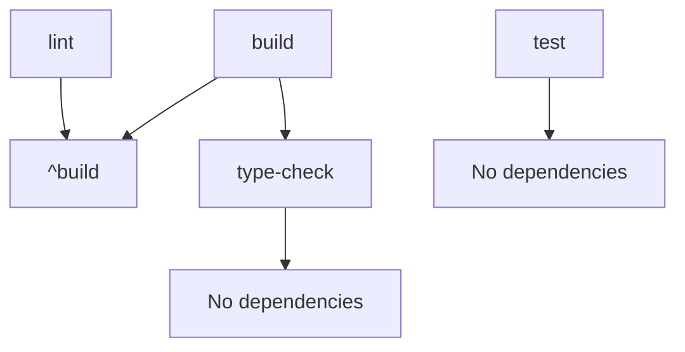

compose-client is a modern frontend development toolkit based on the Vue3 ecosystem, built with a Monorepo architecture using PNPM Workspace + Turbo.

## Project Positioning

compose-client is a comprehensive frontend development toolkit providing a full-stack frontend solution from UI component libraries to platform SDKs.

## Core Architecture

### Technology Stack Requirements

- **Node.js**: 24.10.0+
- **PNPM**: 10.18.2+
- **Turbo**: 2.5.8+
- **TypeScript**: 5.9.3+
- **Build Tools**: TSDown + Vite + Vitest
- **CSS Framework**: UnoCSS + SCSS
- **Version Management**: PNPM Catalog unified version management

### Monorepo Structure

The project adopts PNPM Workspace to manage multi-package architecture, implementing task orchestration and build cache optimization through Turbo.

## Core Package Classification

### Configuration Packages (configs/)

- `configs/eslint9/`: ESLint 9 unified configuration
- `configs/tsconfig/`: TypeScript configuration presets
- `configs/uno/`: UnoCSS configuration and themes
- `configs/vite/`: Vite build configuration
- `configs/toolchain-versions-catalogs-versions/`: Toolchain version management

### Foundation Libraries

- `types/`: Global TypeScript type definitions
- `shared/`: Common utility functions and constants
- `vue/`: Vue3 basic tools and installers
- `external/`: Unified encapsulation of third-party libraries (dayjs, lodash-es, vue-router, etc.)

### UI Components

- `ui/`: Vue3 component library, integrating Element Plus, Vuetify, Varlet

### Network and Platform

- `req/`: Network request tool based on ky
- `psdk/tmap/`: Tencent Map SDK encapsulation
- `psdk/wxpa/`: WeChat Official Account SDK encapsulation

### Extension Tools

- `ext/chrome/`: Chrome browser extension development tools

### MCP Services

- `browseruse-mcp/`: Browser Use MCP service implementation

## Build System

### Build Tool Classification

- **TSDown Packages**: configs, shared, types, req, vue, external, psdk, ext, etc.
  - Output formats: ESM + CJS dual format
  - Includes sourcemap and dts type files
- **Vite Packages**: ui package
  - Output format: ESM
  - Includes CSS extraction and Gulp post-processing

### Turbo Task Dependencies



- `build`: Depends on `^build`, `type-check`
- `lint`: Depends on `^build`
- `test`: No dependencies, can run in parallel
- `type-check`: No dependencies, can run in parallel

### Common Commands

````tabs
tab: Build Related
```bash
# Build all packages
pnpm build

# Force fast build
pnpm build:fast

# Concurrent build (12 tasks)
pnpm build:legacy
```

tab: Test Related
```bash
# Run all tests
pnpm test

# Concurrent tests (10 tasks)
pnpm test:legacy

# Test specific package
turbo run test --filter=@truenine/shared
```

tab: Code Quality
```bash
# Lint check
pnpm lint

# Type check
pnpm type-check

# Root directory Lint check
pnpm lint:root
```

tab: Development Server
```bash
# Start all development servers
pnpm dev

# Single task startup
pnpm dev:single

# Concurrent startup (6 tasks)
pnpm dev:legacy

# Start UI component playground
turbo run dev --filter=@truenine/ui
```

tab: CI Related
```bash
# CI build (includes all checks)
pnpm ci:build

# CI quick check (excludes tests)
pnpm ci:quick
```
````

## Package Management Specifications

### PNPM Catalog Specifications

The project uses PNPM Catalog for unified version management:

- All external dependency versions are centrally managed in `pnpm-workspace.yaml`
- Workspace packages reference each other through `workspace:^`
- Packages are published to npm with `@truenine/` scope, under LGPL-2.1-or-later license

### Catalog Classification

- `catalog`: Common dependencies (dayjs, element-plus, lodash-es, etc.)
- `catalogs.chrome`: Chrome extension related
- `catalogs.cssnano`: CSS compression tools
- `catalogs.eslint`: ESLint related
- `catalogs.gulp`: Gulp build tools
- `catalogs.iconify`: Icon libraries
- `catalogs.mcp`: MCP related
- `catalogs.node`: Node.js related
- `catalogs.rollup`: Rollup tools
- `catalogs.tsdown`: TSDown compiler
- `catalogs.types`: Type definitions
- `catalogs.unocss`: UnoCSS related
- `catalogs.vee-validate`: Form validation
- `catalogs.vite`: Vite build tools
- `catalogs.vitest`: Vitest testing framework
- `catalogs.vue`: Vue3 ecosystem
- `catalogs.vuetify`: Vuetify UI framework
- `catalogs.vueuse`: VueUse utility library

## Testing Specifications

### Testing Environment

- **Testing Framework**: Vitest + jsdom environment
- **Component Testing**: @vue/test-utils
- **Configuration Files**: Root-level `vitest.workspace.ts` + each package's `vitest.config.ts`
- **Test Directory**: `__tests__/` directory or `.spec.ts` suffix files

### Testing Commands

```bash
# Run all tests
pnpm test

# Test specific package
turbo run test --filter=package-name

# Run specific test file
cd packages/package-name && npx vitest run path/to/test.spec.ts

# Run tests in Watch mode
cd packages/package-name && npx vitest watch path/to/test.spec.ts
```

## Playground Development

The ui package contains a playground directory for development and debugging:

```bash
# Start UI component playground
turbo run dev --filter=@truenine/ui
```

Playground uses Vue Router for page management, providing component preview and debugging functionality.

## AI Agent Work Constraints

### Code Editing Specifications

WHEN editing or creating code, MUST follow these constraints:

- Strictly follow TypeScript type safety, prohibit using `any` type
- Follow ESLint configuration rules
- Prefer using ESM module format
- Components and utility functions MUST include appropriate unit tests
- Style files use SCSS syntax
- Strictly follow UnoCSS atomic CSS specifications

### Package Reference Specifications

- Workspace internal package references use `workspace:^`
- External dependency version references use `catalog:` or `catalog:catalog-name`
- Prohibit hardcoding external dependency versions in package.json

### Build Validation Specifications

After completing code modifications, MUST EXECUTE the following validations:

```bash
# Type check
pnpm type-check

# Lint check
pnpm lint

# Run tests
pnpm test

# Build validation
pnpm build
```

### File Modification Constraints

- Prefer editing existing files, avoid creating new files
- New files MUST have sufficient justification and conform to existing architectural specifications
- Strictly follow existing directory and module organization methods
- Prohibit modifying catalog versions in `pnpm-workspace.yaml` unless explicitly requested by the user

## Troubleshooting Guide

### Common Issues

1. **Dependency Installation Failure**
   ```bash
   # Clean dependencies and reinstall
   rm -rf node_modules pnpm-lock.yaml
   pnpm install
   ```

2. **Build Cache Issues**
   ```bash
   # Clean Turbo cache
   turbo clean
   pnpm build
   ```

3. **Type Check Errors**
   ```bash
   # Clean TypeScript build information
   find . -name "*.tsbuildinfo" -delete
   pnpm type-check
   ```

4. **Playground Startup Failure**
   ```bash
   # Ensure dependencies are built
   pnpm build --filter=@truenine/ui...
   turbo run dev --filter=@truenine/ui
   ```

### Diagnostic Commands

```bash
# View package dependency tree
pnpm list --depth=1

# View Turbo task dependencies
turbo run build --dry-run --graph

# Check workspace configuration
pnpm -r list
```

## License

This project is licensed under LGPL-2.1-or-later.

